## 2.1 基础功能
加载完图像后，就可以对图像进行各种编辑和操作

Monica 的很多按钮，都带有 tooltips ，例如这个涂鸦功能

点击按钮就可以进入涂鸦界面，对图像进行随意的涂鸦。

由于 Monica 是一款桌面软件，画笔由鼠标进行控制。画笔默认是黑色的，可以随着鼠标的移动而进行绘制曲线。Monica 支持选择画笔的颜色，以及选择画笔的粗细。
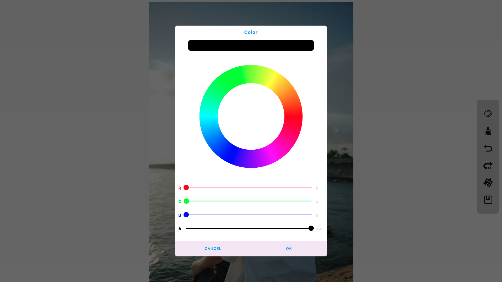

涂鸦完之后，记得保存图片，这样回到主界面之后才真正的保存结果了。
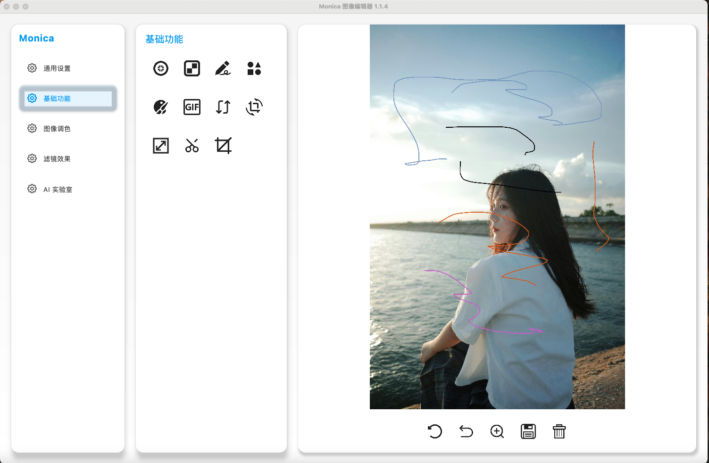

在基础功能里，还有一个比较有意思的功能，对图像取色

这个功能通过点击图像中的位置，获取颜色相关的信息，包括 HEX 颜色代码值、RGB 值、HSL 值和 HSV 值。
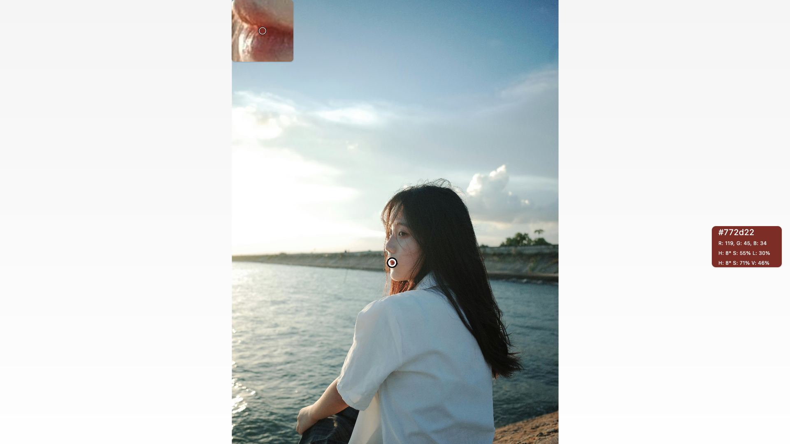
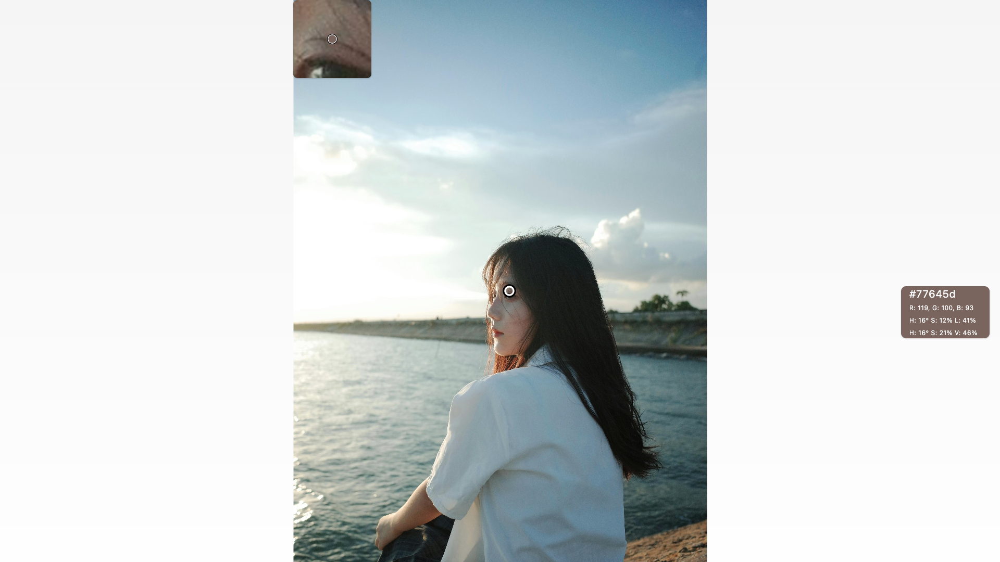

## 2.2 裁剪
基础功能有个比较强大的功能——裁剪 ，通过点击带提示的裁剪按钮
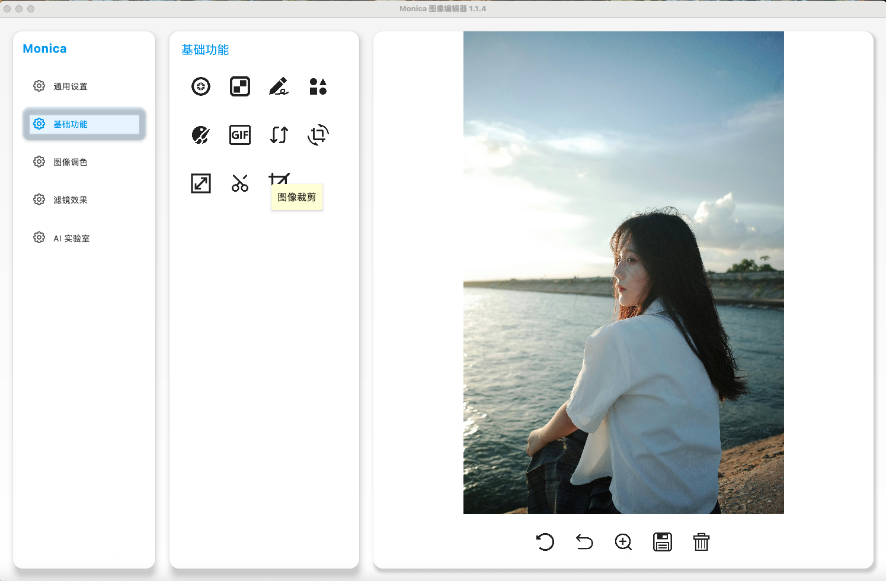

可以进入图像裁剪的界面

用户可以基于九宫格的选框，对图像进行裁剪。
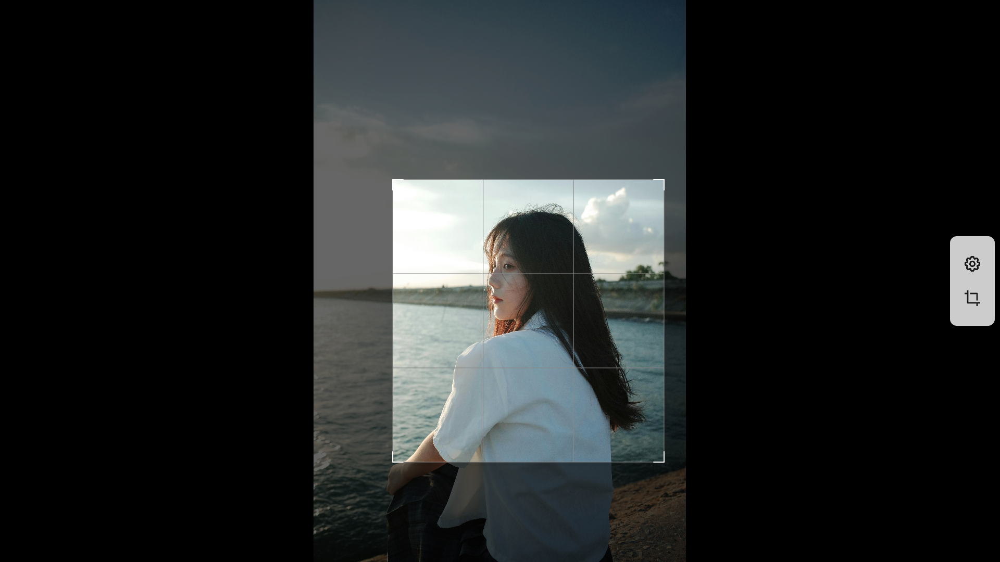
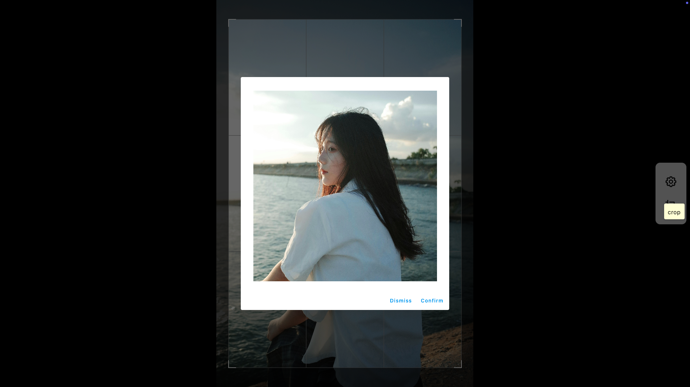

裁剪完之后，会在主界面显示截取之后的图像。

当然，这只是最基本的裁剪功能，Monica 可以通过设置裁剪属性支持多种形式的裁剪。

下面，我们以正六边形为裁剪框来裁剪图像

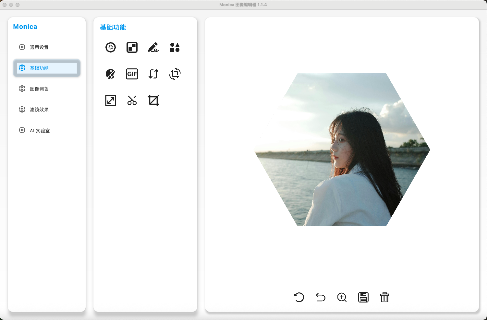

接下来，还可以以爱心为裁剪框来裁剪图像

## 2.3 图像绘制
形状绘制的入口

绘制形状的页面

Monica 提供了图像上的任意位置绘制各种图形的功能，以及修改图形的属性比如图像的颜色、透明度、是否填充、边框类型。

保存图像

## 2.4 图像调色
Monica 支持调节图像的对比度、色调、饱和度、亮度、色温等，从而帮助大家调整图像的色彩。

图像调色的入口

图像调色的界面
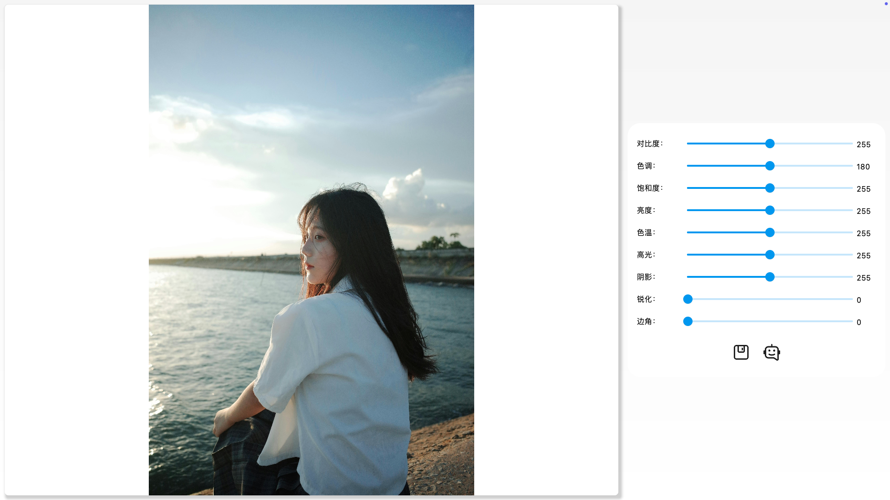

支持拖动调节各个参数

保存图像
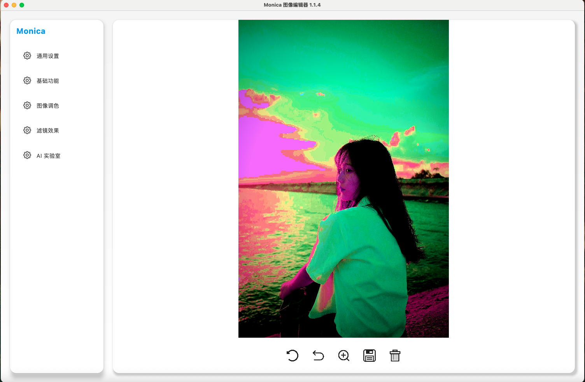

## 2.5 滤镜
Monica 支持多达 50 多款滤镜，大多数可以自行调整参数。
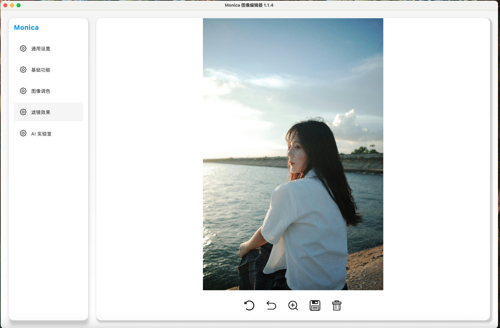

如果需要修改滤镜的默认参数，可以直接修改。
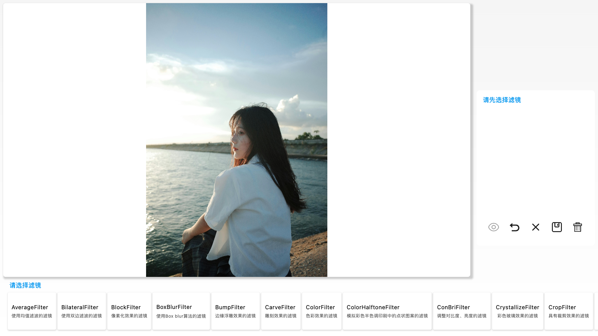

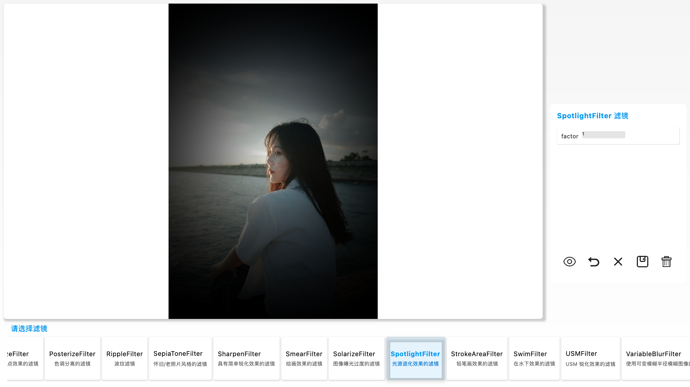

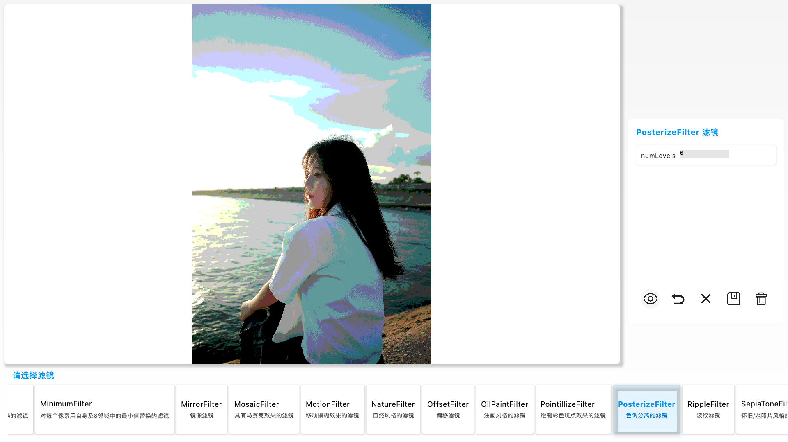

各种滤镜效果可以不断叠加，也可以跟其他功能一起使用。

## 2.6 深度学习的算法
在 AI 实验室有一些比较有意思的算法，比如人脸检测、生成素描画、人脸替换

人脸检测包括:人脸、年龄、性别检测

生成素描画的效果

人脸替换
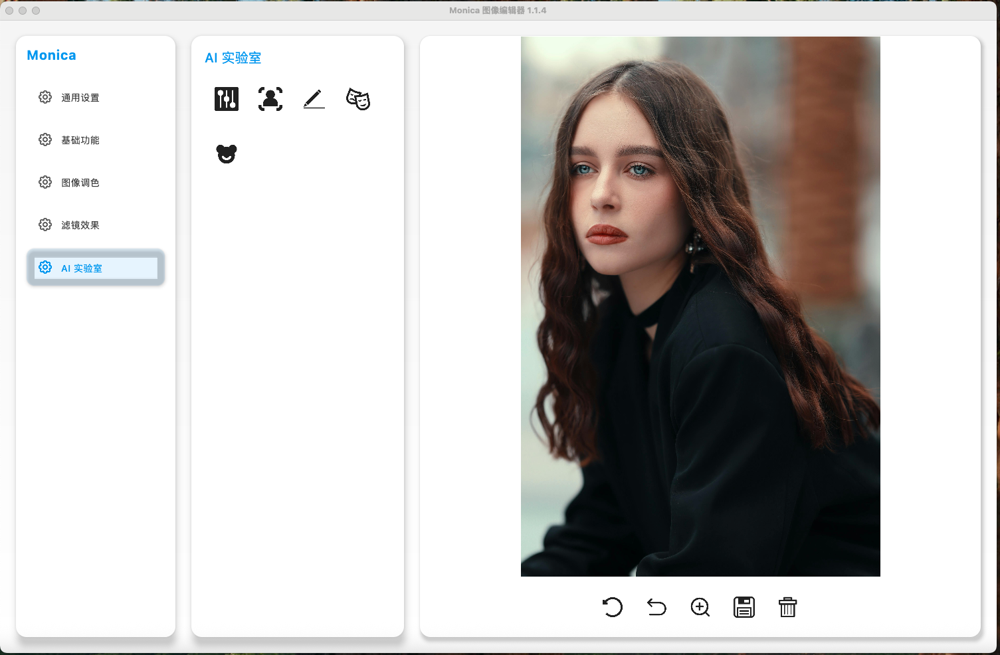

"人脸替换"需要一张源图和加载一张目标图片。

"人脸替换"也支持将目标图中所有的人脸进行替换。

只需要设置一下替换 target 中人脸的数量即可。

就可以完成目标图中所有的人脸替换。

## 2.7 快速验证 OpenCV 算法的功能

稍后更新