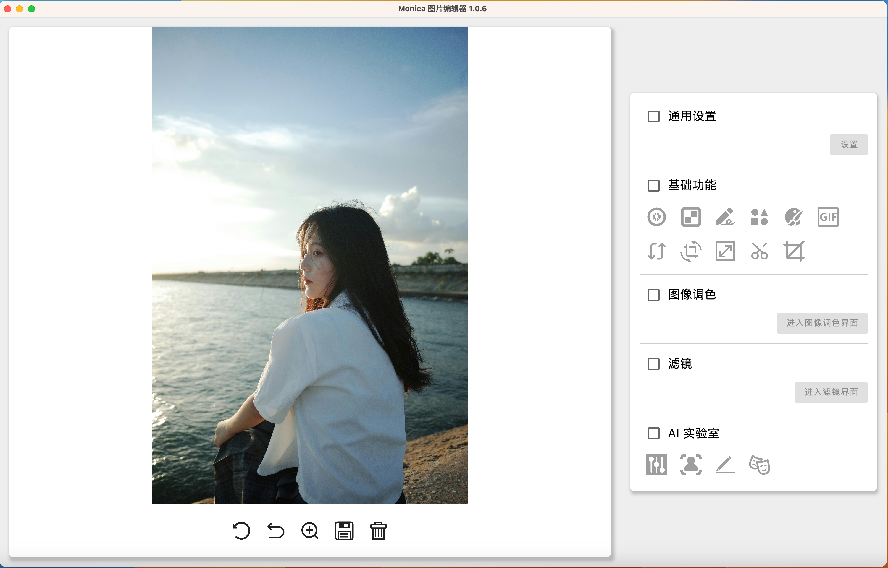
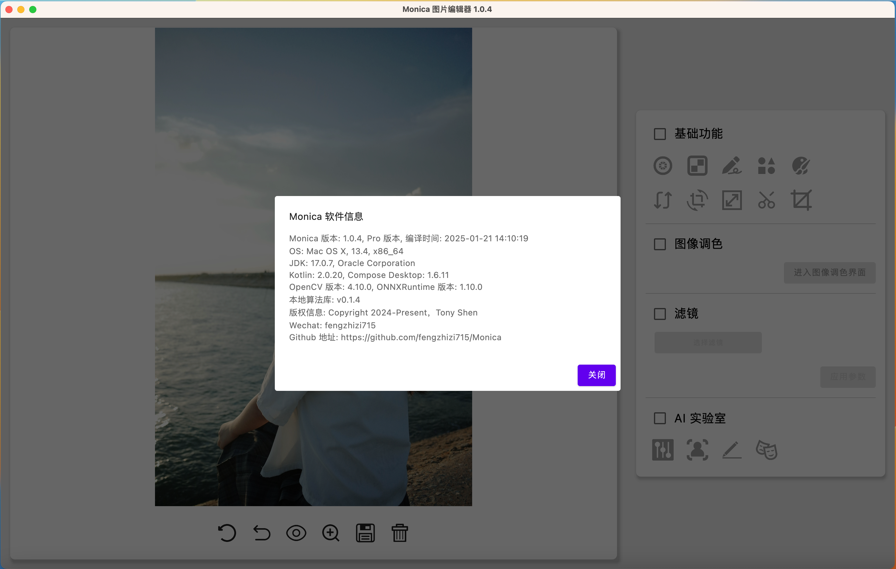

# Monica
Monica 是一款跨平台的桌面图像编辑软件(早期是为了验证一些算法而产生的)。

其技术栈如下：
* Kotlin 编写 UI(Kotlin Compose Desktop 作为 UI 框架)
* 基于 mvvm 模式，依赖注入使用 koin，编译使用 JDK 17
* 部分算法使用 Kotlin 实现
* 传统的 CV 算法使用 OpenCV C++ 来实现，Kotlin 通过 jni 来调用。
* 深度学习的模型，主要使用 ONNXRuntime 来部署和加速，使用 C++ 实现。

# 一. 简介

Monica 目前还处于开发阶段，当前提供的基础功能：

* 支持图像放大预览。
* 支持对图像进行局部模糊、打马赛克。
* 支持对图像进行涂鸦，并保存涂鸦的结果。
* 支持对图像绘制各种形状和动态添加文字，并保存结果。
* 支持图像取色功能。
* 支持图像的翻转、旋转、缩放、错切。
* 支持各种形状的裁剪，并保存裁剪的结果。
* 支持调整图像的对比度、色调、饱和度、亮度、色温、高光、阴影等。
* 提供 50 多款滤镜，且大多数滤镜可以单独调参。
* 支持将多张图片生成 gif
* 支持多种格式的导入、导出
  * 支持 jpg、png、webp、svg、hdr 格式的图像导入
  * 支持 cr2、cr3 等多种相机拍摄的 RAW 文件的导入
  * 支持导出成 jpg、png、webp 格式的图像
* 提供快速验证 OpenCV 算法的功能(目前提供一些简单算法的调参)

深度学习相关的功能：

* 人脸检测(人脸、性别、年龄)
* 生成素描画
* 替换人脸
* 生成多种风格的漫画

# 二. 功能

截图较多，详细的功能跳转到单独的页面。[功能详见](FUNCTION.md)

# 三. CV 算法 && 调用深度学习的模型

## 3.1 CV 算法

CV 算法的地址：
https://github.com/fengzhizi715/MonicaImageProcess

目前在 Mac、Windows、Linux 环境下编译的了相关的算法库，Kotlin 通过 jni 来调用该算法库。(在开发过程中 MacOS 的算法库会比较新，因为我的开发环境是在 MacOS 下)

其中

| 库名                                  | 版本号   | 描述                           |
|-------------------------------------|-------|------------------------------|
| libMonicaImageProcess.dylib         | 0.2.1 | 基于 intel 芯片的 Mac OS 下编译好的算法库 |
| libMonicaImageProcess_aarch64.dylib | 0.2.1 | 基于 m 芯片的 Mac OS 下编译好的算法库     |
| MonicaImageProcess.dll              |       | Windows 下编译好的算法库需要依赖 opencv_world481.dll |
| opencv_world481.dll                 |       | Windows 下基于 OpenCV 4.8.1 源码编译的 OpenCV 库 |
| libMonicaImageProcess.so            | 0.2.0 | Linux 下编译好的算法库                          |

## 3.2 深度学习的服务

深度学习相关服务的源码：https://github.com/fengzhizi715/MonicaImageProcessHttpServer

Monica 通过 http 来调用算法服务，实现推理。

# 四. 更多详情

Monica 还有很多有意思的功能没有来得及介绍，欢迎体验、使用、提意见和需求。

目前，还不提供安装包。不过可自行编译，后续版本会提供 Windows、Linux、MasOS 等各个平台对应的安装包。

Windows 用户的体验安装包: 
> 链接: https://pan.baidu.com/s/1QrauiGLKUtozkKKB4JKLiQ?pwd=u9jn
> 
> 由于是体验版本，少了一些深度学习相关的功能。

在如下的专栏，有相关文章的介绍

https://juejin.cn/column/7396157773312065574

# 五. TODO List：

* 解决 Mac 打包的问题
* 增加人脸美颜的功能
* 重构形状绘制模块
* 增加商品美化的功能
* 优化软件的各种体验
* 增加读取 EXIF 信息
* 升级 Compose desktop 版本
* 升级第三方库(特别是自己维护的库)

# 六. 更新日志

请查看 [CHANGELOG](CHANGELOG.md) 文件

# 七. 联系方式：

wechat：fengzhizi715

Email：fengzhizi715@126.com

# 八. Star History

