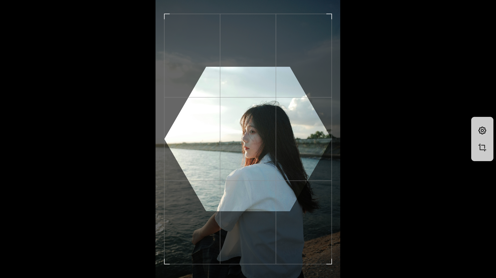
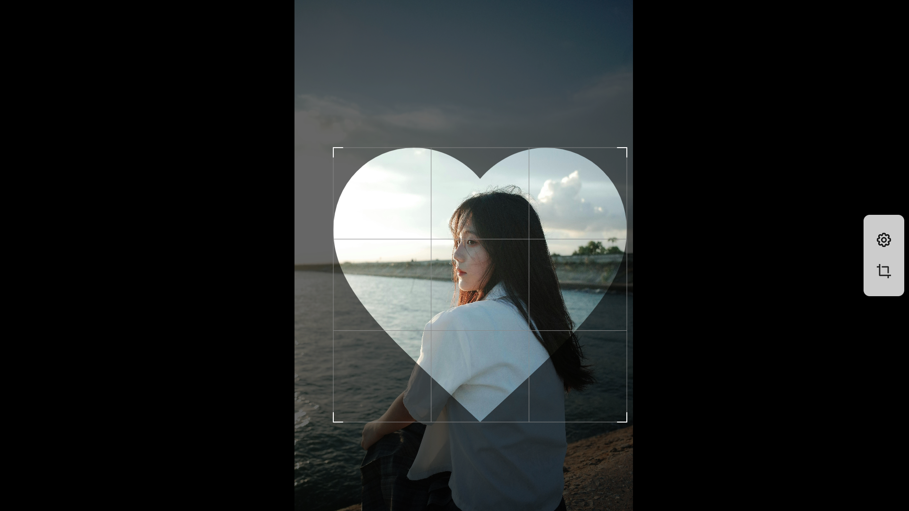
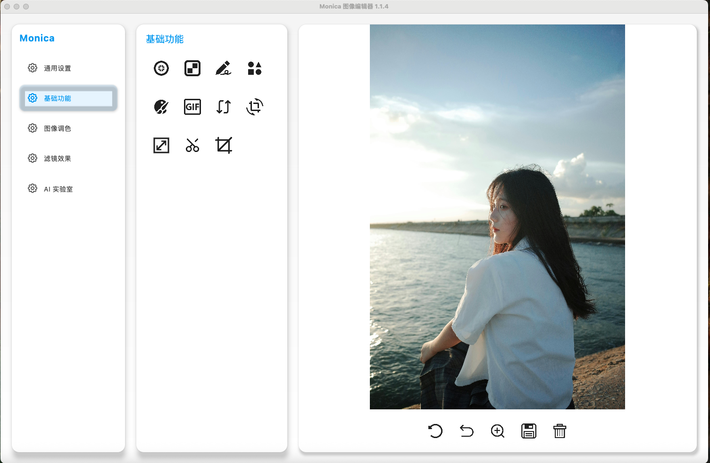
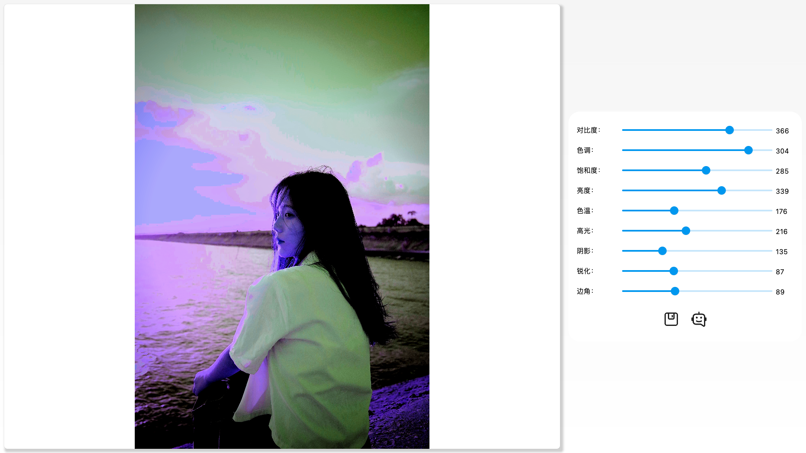

# Monica
Monica 是一款跨平台的桌面图像编辑软件，使用 Kotlin Compose Desktop 进行开发。

它基于 mvvm 架构，由于应用层都是由 Kotlin 编写的，所以使用 koin 作为依赖注入框架。

# 一. 简介
Monica 目前还处于开发阶段，当前版本的主要功能包括：

* 支持加载本地图片、网络图片。
* 支持对图片进行局部模糊、打马赛克。
* 支持对图片进行涂鸦，并保存涂鸦的结果。
* 支持图片取色功能
* 支持图像的翻转、旋转、缩放
* 支持各种形状的裁剪，并保存裁剪的结果。
* 调整图片的饱和度、色相、亮度。
* 提供 20 多款滤镜，大多数滤镜可以单独调整参数。
* 保存修改的图像。

# 二. 功能

## 2.1 基础功能
加载完图像后，可以对图像进行各种编辑

很多按钮，都带有 tooltips，例如这个涂鸦功能

点击按钮就可以进入涂鸦界面，对图像进行随意的涂鸦。

由于是桌面软件，画笔由鼠标进行控制。画笔默认是黑色的，可以随着鼠标的移动而进行绘制曲线。Monica 支持选择画笔的颜色，以及选择画笔的粗细。

涂鸦完之后，记得保存图片，这样回到主界面之后才真正的保存结果了。

在基础功能里，还有一个比较有意思的功能，对图像取色

这个功能通过点击图像中的位置，获取颜色相关的信息，包括 HEX 颜色代码值、RGB 值、HSL 值和 HSV 值。

## 2.2 裁剪

通过点击带提示的裁剪按钮

可以进入图像裁剪的界面

用户可以基于九宫格的选框，对图像进行裁剪。

裁剪完之后，会在主界面显示截取之后的图像。

当然，这只是最基本的裁剪功能，Monica 可以通过设置裁剪属性支持多种形式的裁剪。

下面，我们以正六边形为裁剪框来裁剪图像

接下来，还可以以爱心为裁剪框来裁剪图像

## 2.3 图像处理
Monica 支持调整图像的饱和度、色相、亮度，也就是在 HSL 色彩空间调色。

## 2.4 滤镜
Monica 支持多达 20 多款滤镜，大多数可以自行调整参数。

如果需要修改滤镜的默认参数，修改完之后需要点击“应用参数”这个按钮，否则无法生效。

各种滤镜效果可以不断叠加，也可以跟 HSL 调色以及基础功能一起使用。

# 三. 更多详情

Monica 还有很多有意思的功能没有来得及介绍，欢迎体验和使用，也欢迎提意见。

目前，暂时还不提供安装包不过可自行编译。等版本相对稳定后，会提供 Windows/Linux/MacOS 的安装包。

之前介绍的文章：

https://juejin.cn/post/7365711904159612954

https://juejin.cn/post/7374238968685920282

# 四. TODO List：

* 增加对图像添加文字的功能。
* 优化部分算法，提高效率。
* 考虑增加人脸美颜的算法。
* 考虑实现多图的导入。