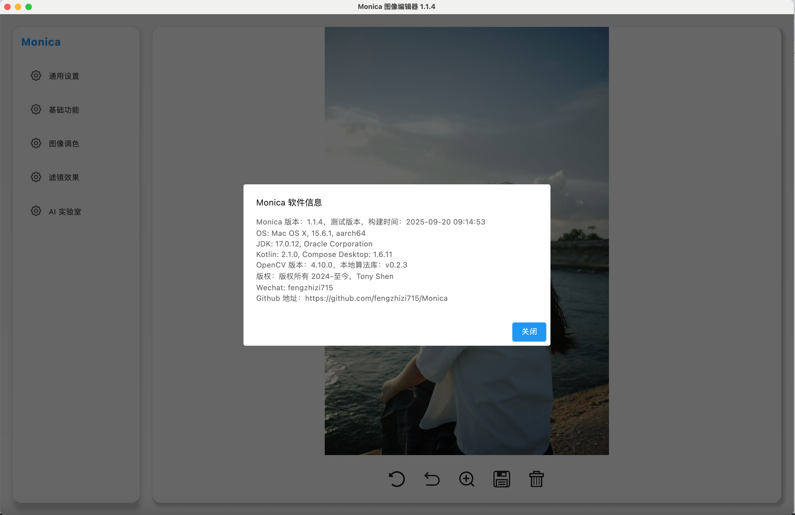
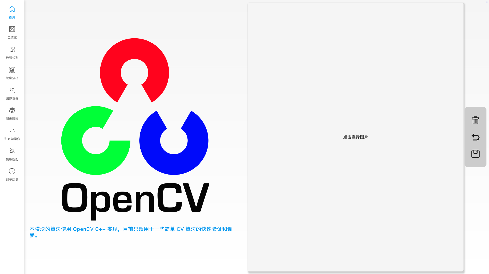

**Monica** 是一款跨平台的桌面图像编辑软件。它不仅支持多种图像格式（包括相机 RAW），还集成了传统图像处理和基于深度学习的图像增强功能，提供可扩展、可二次开发的图像编辑体验。

# 🧪 技术栈
* **UI 框架**：Kotlin Compose Multiplatform (Desktop)
* **图像处理**：OpenCV
* **深度学习推理**：ONNX Runtime
* **后端语言**：Kotlin / C++
* **构建工具**：Gradle / CMake

# ✨ 功能列表
## 📷 图像处理功能
* 支持导入：JPG、PNG、WebP、SVG、HDR、HEIC
* 支持相机 RAW 文件导入：CR2、CR3 等
* 支持导出：JPG、PNG、WebP
* 图像放大预览
* 局部模糊、马赛克处理
* 涂鸦、绘制形状、添加文字
* 图像取色
* 图像几何变换：翻转、旋转、缩放、错切
* 支持各种形状的裁剪
* 调整参数：对比度、色调、饱和度、亮度、色温、高光、阴影
* 50+ 可调节滤镜
* 多图合成 GIF
* 快速验证 OpenCV 算法，支持简单算法的调参

## 🤖 深度学习增强功能
* 人脸检测(人脸、性别、年龄)
* 图像生成素描画
* 替换人脸
* 多种风格的漫画生成

# 📦 安装与运行

## 从源码运行
使用 IntelliJ IDEA / IntelliJ IDEA CE

```
git clone https://github.com/fengzhizi715/Monica.git
```

## 🍎 macOS 安装包
### Intel 芯片：
Monica-x64-1.1.4.dmg

链接: https://pan.baidu.com/s/1ZS2e8krIh_kGUUEogMknrg?pwd=eyx7

### M 芯片：
Monica-arm64-1.1.4.dmg

链接: https://pan.baidu.com/s/1JJwT_UNFrQa-tUsAYywqkA?pwd=mngu

## 🖥 Windows 安装包
Monica-1.0.9.exe (最近没有 windows 电脑，稍后提供最新的版本)

链接: https://pan.baidu.com/s/1jL0bL17Omxtc2rqOBn9yWg?pwd=5dii

## 🐧 CentOS 安装包
稍后提供

# 📸 项目截图

## ✨ UI 新版预览图
支持 **英文版 UI + 多主题颜色切换**

英文版界面示例


主题切换


深色主题


紫色主题


## 📷 经典功能界面








更多截图 👉 [详细功能介绍](FUNCTION.md)

专栏文章 👉 [掘金专栏](https://juejin.cn/column/7396157773312065574)

# 📁 CV 算法 && 深度学习的服务

## ⚙️ CV 算法

CV 算法的地址：
https://github.com/fengzhizi715/MonicaImageProcess

目前在 macOS、Windows 环境下编译好了相关的算法库，Kotlin 通过 jni 来调用该算法库。


| 库名                                   | 版本号   | 描述                                                 | 备注                             |
|---------------------------------------|-------|------------------------------------------------------|---------------------------------|
| libMonicaImageProcess.dylib           | 0.2.3 | macOS 下编译好的算法库                                  | 使用 CLion 编译                  |
| libopencv_world.4.10.0.dylib          |       | macOS 下基于 OpenCV 4.10.0 源码编译的 OpenCV 库          | 使用 cmake 编译                  |
| MonicaImageProcess.dll                | 0.2.1 | Windows 下编译好的算法库需要依赖 opencv_world481.dll      | 使用 Visual Studio 2022 编译     |
| opencv_world481.dll                   |       | Windows 下基于 OpenCV 4.8.1 源码编译的 OpenCV 库         | 使用 Visual Studio 2022 编译     |


## ☁️ 深度学习的服务

Monica 通过 HTTP 调用深度学习推理服务。需在 **通用设置** 中配置 `算法服务 URL`。

源码与模型 👉 https://github.com/fengzhizi715/MonicaImageProcessHttpServer

> 未部署线上服务，感兴趣可自行编译和部署


# 💻 项目计划：
* - [x] 多格式导入导出支持
* - [x] 图像基础编辑功能
* - [x] 深度学习模块集成
* - [ ] 支持插件机制
* - [ ] 添加更多 AI 功能（如人脸美颜、去背景、风格化等）

近期的 TODO : 

* 优化滤镜模块，使用 LLM 实现自然语言使用滤镜
* 增加人脸美颜的功能
* 增加插件机制
* 增加图像压缩的功能
* 优化图像裁剪的功能
* 完善配置管理
* 升级 Kotlin Compose desktop、第三方库的版本


# 🤝 贡献方式
欢迎任何形式的贡献，包括但不限于功能开发、Bug 修复、文档完善和使用反馈。


# 📄 开源协议
本项目基于 Apache License 2.0 开源。


# 📝 更新日志

请查看 [CHANGELOG](CHANGELOG.md) 文件


# 📬 联系方式：

wechat：fengzhizi715

Email：fengzhizi715@126.com


# 📈 Star History

[](https://star-history.com/#fengzhizi715/Monica&Date)